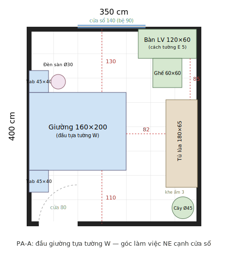

# 🏠 Interior Design Skills for Claude Code

**Design your own room or home like a professional interior designer — guided step-by-step by Claude.**

[](LICENSE)
[](https://claude.com/claude-code)
[](README.vi.md)
[](ROADMAP.md)

🇻🇳 **[Đọc bản tiếng Việt](README.vi.md)** — the pipeline itself runs in Vietnamese (units in cm, prices in VND).

---

A suite of 7 [Agent Skills](https://docs.claude.com/en/docs/claude-code/skills) that turns a Claude Code session into your personal interior designer. It follows the same pipeline professionals use — client brief, style concept, space planning, visualization, budgeting — and leaves you with a complete, versionable design dossier as plain files: YAML, Markdown, SVG, HTML.

## ✨ See it in action

A scaled floor plan generated from real room measurements (1px = 1cm), with automatic ergonomic validation:

<p align="center">
  
</p>

Browse the complete sample dossier in [`designs/phong-ngu-mau/`](designs/phong-ngu-mau/) — a 3.5×4m bedroom on a 50M VND budget, from interview brief to a printable [HTML design board](designs/phong-ngu-mau/06-presentation.html).

## 🔁 The pipeline

| Step | Command | What it does | Output |
|---|---|---|---|
| — | `/interior` | Orchestrator: tracks progress, routes you to the next step | — |
| 1 | `/interior-brief` | Interviews you about needs & lifestyle, guides room measurement | `00-project.yaml`, `01-brief.md` |
| 2 | `/interior-concept` | Proposes 2–3 deliberately contrasting concepts (style, palette, materials) — you pick | `02-concept.md` |
| 3 | `/interior-layout` | Draws a to-scale SVG floor plan, validates ~20 ergonomic rules from real coordinates | `03-layout.svg`, `03-layout.md` |
| 4 | `/interior-render` | Generates scene-accurate image prompts for Midjourney / DALL-E / SDXL | `04-render-prompts.md` |
| 5 | `/interior-budget` | Builds a budget with Vietnam price ranges, shopping list, install & inspection checklists | `05-du-toan.md` |
| 6 | `/interior-present` | *(optional)* Compiles everything into a single self-contained HTML design board | `06-presentation.html` |

Hard ordering: brief → concept → layout. Every skill checks its prerequisites — call them in any order and you'll be routed to the right step. Each room is a folder under `designs/`; design a whole home by running the pipeline per room.

## 💡 Why this exists

- **Verified layouts, not vibes** — furniture placement is checked against ergonomic standards (walkway ≥ 60cm, wardrobe clearance, TV viewing distance…) computed from actual SVG coordinates, with a pass/fail report.
- **Budget grounded in local reality** — three price tiers (budget / mid / premium) for the Vietnamese market, automatic comparison against your total, concrete cut-down options when over budget.
- **Your dossier is just files in a repo** — diff it, edit it by hand, share it, regenerate any stage. No app lock-in.
- **You stay in control** — the skills interview, propose options with trade-offs, and wait for your decision at every meaningful checkpoint.

## 🚀 Quick start

```bash
git clone git@github.com:Hai4320/InteriorDesign.git
cd InteriorDesign
claude
```

Skills load automatically from `.claude/skills/`. Type `/interior` and follow along.

> **Note:** the skills converse and write documents in Vietnamese. An English-language pipeline is a welcome contribution — see [ROADMAP.md](ROADMAP.md).

## 📁 Repository layout

```
.claude/skills/
  interior/               # orchestrator + shared reference data
    references/
      ergonomics.md       # clearance standards the layout step validates against
      styles.md           # 10 styles with palettes & signature materials
      furniture-sizes.md  # standard furniture footprints
      price-ranges-vn.md  # VND price ranges by tier
  interior-brief/         # step 1 — client brief & measurements
  interior-concept/       # step 2 — style concepts
  interior-layout/        # step 3 — scaled floor plan + ergonomic checks
  interior-render/        # step 4 — AI render prompts
  interior-budget/        # step 5 — budget & shopping list
  interior-present/       # step 6 — HTML design board
designs/                  # one folder per room (your design dossiers)
  phong-ngu-mau/          # complete sample project
ROADMAP.md                # quality-improvement plan (schema, hooks, reviews…)
```

## 🔧 Customization

All domain knowledge lives in editable Markdown under [`.claude/skills/interior/references/`](.claude/skills/interior/references/):

- Add a style → `styles.md`
- Update prices from your own research → `price-ranges-vn.md` *(shipped ranges are 2025–2026 estimates)*
- Tighten or relax ergonomic rules → `ergonomics.md` — the layout skill picks them up automatically

## 🗺 Roadmap

Schema-validated artifacts, deterministic geometry checks, hooks, an LLM-judge review skill, change propagation across the pipeline — all with human-in-the-loop as the overriding principle. Details in [ROADMAP.md](ROADMAP.md).

## ⚠️ Disclaimers

- Budget figures are **reference ranges** — always verify real prices before purchasing.
- AI renders are **mood illustrations**, not technical drawings.
- For work touching structure, electrical, or plumbing, consult a qualified professional.

## 📄 License

[MIT](LICENSE)
